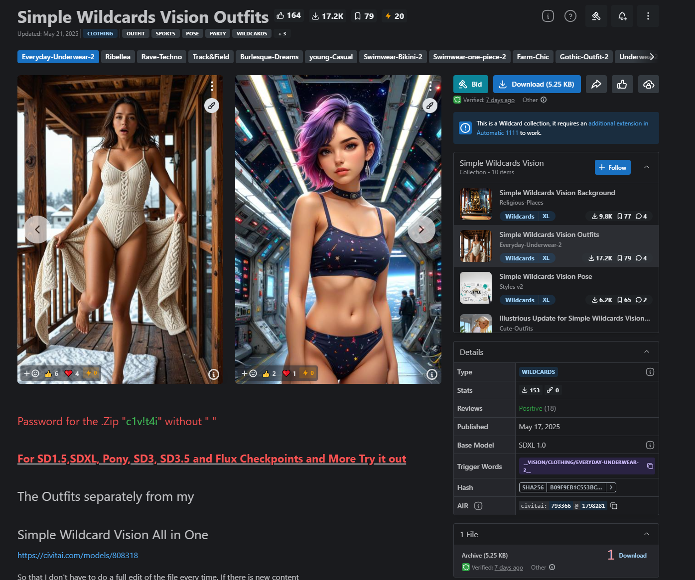
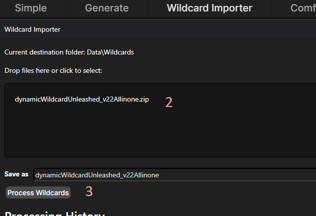
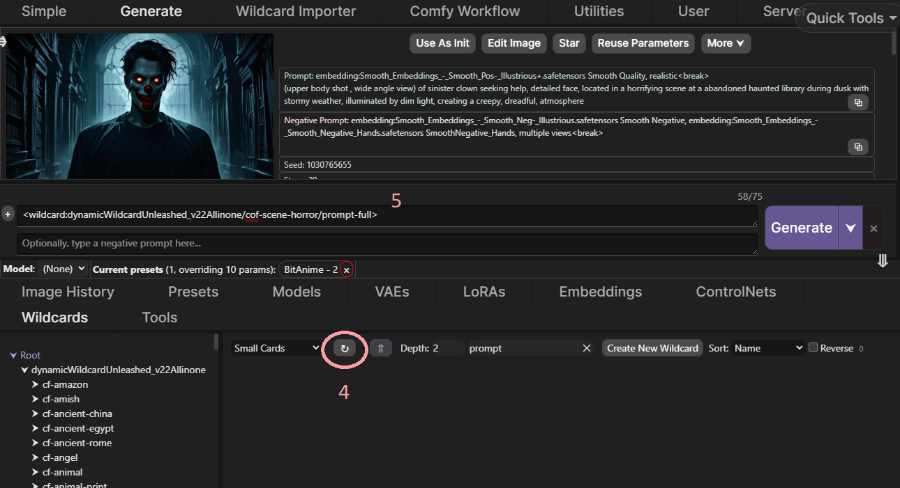
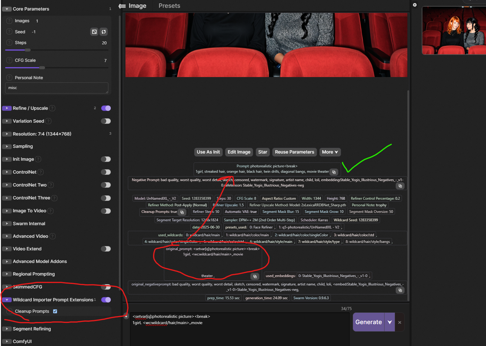

# Wildcard Importer & Prompt Utilities Extension for SwarmUI

This extension for [SwarmUI](https://github.com/mcmonkeyprojects/SwarmUI) adds the following features:

1. Wildcard Importer - allows you to import Wildcard Collections from Civit or elsewhere into SwarmUI.  See below for usage instructions.
2. Prompt Utilities - adds prompt utilities such as prompt cleanup and auto-breaking. See _Prompt Utilities_ below for more information.
3. WC Detailer - an advanced automatic segmentation and inpainting feature for SwarmUI.  See [wcdetailer](./wcdetailer.md) for more information.

## Wildcard Importer

It can automatically convert the collections from
[SD Dynamic Prompt format](https://github.com/adieyal/sd-dynamic-prompts/blob/main/docs/SYNTAX.md#wildcards)
format into SwarmUI's wildcard prompt format.

# Usage Instructions

It is as easy as counting to 5.

----

First, download a Wildcard collection from Civit or elsewhere.

---

Second, switch to the Wildcard Importer tab in SwarmUI and drag your downloaded file into the dropzone.
The importer supports: `.txt`, `.yaml` and `.zip` files.

Third, click the "Process Wildcards" button and wait for the import to complete.

---

Fourth, switch back to Generate tab and goto Wildcards tab at bottom and click the Refresh button to see the imported
collection.

Fifth, enter a wildcard prompt and click Generate!

## Prompt Utilities

The extension adds a new section to the generation parameters.  Currently there is only one new item in this section.

* Cleanup Prompts - if enabled, then your prompts will be cleaned up.  Extraneous whitespace will be removed.  Newlines will be replaced with spaces.  Unnecessary commas will be removed.  This is really useful when working with wildcards which occasionally inject multiple commas.
* AutoBreak - Automatically insert `<break>` tags in long prompts to keep each part <= 75 tokens.  Optimized for booru tag prompting style, this will intelligently look for safe places to break your prompt where it will not split a prompt mid-tag.

With both options enabled, turns a prompt like this:

> <setvar[q]:masterpiece, best quality, absurdres>,
> scenery, impressionism, oil painting \(medium\), warm lighting, brush strokes, cool colors, blue background, color contrast, glow effect,
> 1girl, solo, looking_at_viewer, smile, red_eyes, hair_between_eyes, collarbone, ahoge, braid, sidelocks, ass, red_hair, lying, alternate_costume, sky, sleeveless, medium_hair, barefoot, indoors, halo, nail_polish, blurry, feet, toes, pillow, window, single_braid, night, bed, soles, depth_of_field, bed_sheet, arm_support, black_nails, on_stomach, building, star_(sky), night_sky, starry_sky, legs_up, head_rest, pajamas, spaghetti_strap, bare_back, lamp, bedroom, the_pose, feet_up, skyscraper, crossed_ankles, skyline, desk lamp,
> 
> <segment:face | hair,0.3, 0.4><var:q>, scenery, impressionism, oil painting \(medium\), warm lighting, brush strokes, cool colors, color contrast, glow effect,
> portrait, 1girl, looking at viewer, smile, red eyes, hair between eyes, ahoge, braid, sidelocks, red hair, medium hair, single braid

into this:

> masterpiece, best quality, absurdres, scenery, impressionism, oil painting \(medium\) , warm lighting, brush strokes, cool colors, blue background, color contrast, glow effect, 1girl, solo, looking_at_viewer, smile, red_ekyes, hair_between_eyes, collarbone, ahoge, braid, sidelocks, ass, red_hair&lt;break&gt;lying, alternate_costume, sky, sleeveless, medium_hair, barefoot, indoors, halo, nail_polish, blurry, feet, toes, pillow, window, single_braid, night, bed, soles, depth_of_field, bed_sheet, arm_support, black_nails, on_stomach, building, star_(sky) , night_sky&lt;break&gt;starry_sky, legs_up, head_rest, pajamas, spaghetti_strap, bare_back, lamp, bedroom, the_pose, feet_up, skyscraper, crossed_ankles, skyline, desk lamp<segment:face | hair,0.3, 0.4//cid=11>masterpiece, best quality, absurdres, scenery, impressionism, oil painting \(medium\) , warm lighting, brush strokes, cool colors, color contrast, glow effect, portrait, 1girl, looking at viewer, smile, red eyes, hair between eyes, ahoge, braid, sidelocks, red hair, medium hair, single braid

