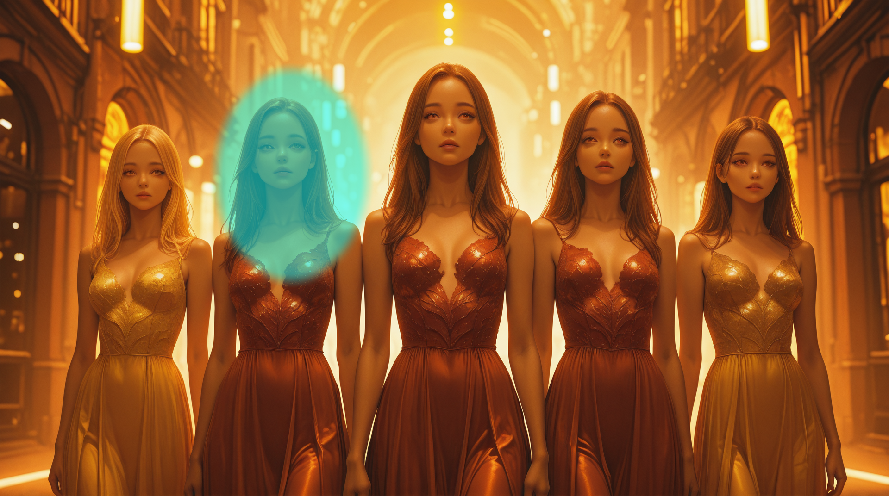
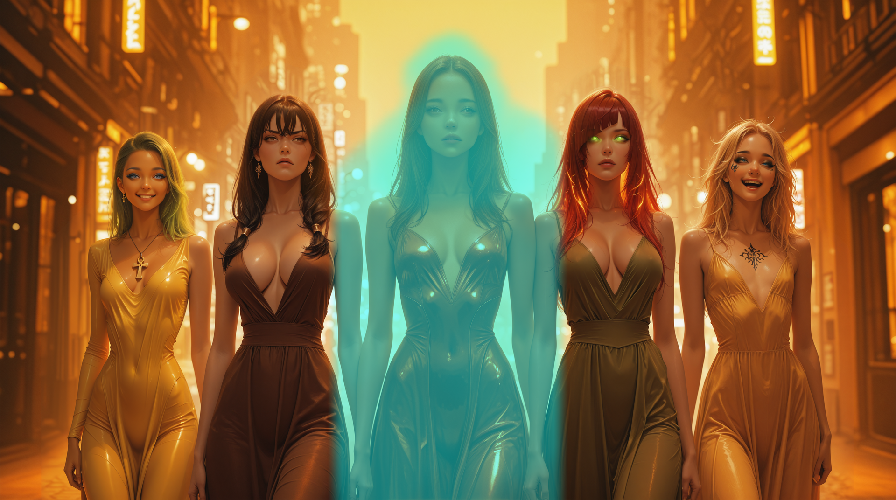

# WC Detailer

WC Detailer lets you perform automatic segmentation and refining of your images as part of your prompt.

It is a more advanced version of SwarmUI's built-in [Segmentation](https://github.com/mcmonkeyprojects/SwarmUI/blob/master/docs/Features/Prompt%20Syntax.md#automatic-segmentation-and-refining)
feature that also gives some basic inpainting capabilities.

## Differences with SwarmUI Segmentation

`<wcdetailer>` can do everything that `<segment>` can do plus these additional features:

1. Supports complex mask expressions:
   1. Supports set operations on masks:
       - Compute the union of two masks: `mask1 | mask2`
       - Compute the intersection of two masks: `mask1 & mask2`
       - Invert a mask: `!mask`
   2. Define rectangular masks
       - From arbitrary coordinates: `box(x,y,width,height)`
       - As a bounding box of a mask: `box(face | hair)`
   3. Define circular masks:
       - From arbitrary coordinates: `circle(x,y,radius)`
       - As a bounding circle of a mask: `circle(face | hair)`
   4. Define elliptical masks:
       - From arbitrary coordinates: `oval(x,y,width,height)`
       - As a bounding oval of a mask: `oval(face | hair)`
   5. Define convex hulls of masks: `hull(face | hair)`
   6. Grow individual and arbitrary masks by a given number of pixels: `oval(face | hair) + 30`
   7. Set thresholds on individual CLIPSEG and YOLO masks: `hair:0.3 | yolo-face_yolov8m-seg_60.pt:0.5`
2. Override WC Detailer parameters on individual `<wcdetailer>` tags
   - `<wcdetailer:[blur:30,creativity:0.2] face | hair>close-up, 1girl, face, ...`
3. If the mask is empty (because the face could not be found or whatever), then WC Detailer avoids needlessly running the model (saves generation time)
4. Supports index operator to extract the Nth object from an arbitrary mask (not just yolo masks):
   - `yolo-face_yolov8m-seg_60.pt[1]` - take the 1st yolo face found
   - `face[2]` - take the 2nd CLIPSEG face found
   - `(face & boy)[2]` - take the 2nd boy face found.
   - `oval((yolo-face_yolov8m-seg_60.pt & box(0.5,0,1,1))[1])` - take the first face found on the right half of the image and convert it to an oval
5. Dynamic Resolution Mode
   - In this mode, when detailing based on a mask, the aspect ratio will be dynamically adjusted to maximize the pixel density of the area being detailed.  If the mask is already higher resolution than the Target Resolution, the mask resolution will be used during detailing.  This improves the quality of the results when the mask aspect ratio is significantly different from the target resolution aspect ratio, or when the mask is a significant portion of the image. 

The ability to define shapes and intersect/union/diff them against CLIPSEG features gives you some powerful automatic inpainting capabilities.
You can, for example, find everything on the right side of the image that is NOT a person and supply a prompt with strong creativity to basically
inpaint something new into the empty space on the right of the image.

## Generation Parameters

The SwarmUI Generate Tab now has a new section for WC Detailer parameters:


## Prompt Syntax

The `wcdetailer` prompt syntax is similar to, but different than the `<segment>` prompt syntax.

**Note**: if you wish to use a yolo model, you must download and store it in `(Swarm)/Models/yolov8` (see [SwarmUI documentation](https://github.com/mcmonkeyprojects/SwarmUI/blob/master/docs/Features/Prompt%20Syntax.md#automatic-segmentation-and-refining)
for more information).

The basic syntax is:

`<wcdetailer:[param1:value1, ..., paramN:valueN] maskspecifier> prompt`

The param:value pairs are optional if you want to override the global settings.

Some examples:

* `<wcdetailer:[blur:30, creativity:0.2] face | hair> close-up, 1girl, face, ...`
* `<wcdetailer: yolo-face_yolov8m-seg_60.pt[1] & girl> close-up, 1girl, face, ...`
* `<wcdetailer:[creativity:0.2] hull(face & !boy)>close-up, 1girl, face, ...`


### Mask Specifiers

A mask specifier can be any of the following:

1. A CLIPSEG mask.  Basically any words.  Simpler works better
   1. `face`
   2. `girl`
   3. `boy hair`
2. A YOLO mask.  You must download and store the model in `(Swarm)/Models/yolov8`
   1. `yolo-face_yolov8m-seg_60.pt`
3. CLIPSEG or YOLO mask with threshold overrides:
   1. `face:0.3`
   2. `yolo-face_yolov8m-seg_60.pt:0.2`
4. A shape mask
   1. `box(0, 0, 0.5, 1)`
   2. `circle(0.5, 0.5, 0.2)`
   3. `oval(0.5, 0.5, 0.2, 0.2)`
5. A mask expression
   1. Union: `maska | maskb`
   2. Intersection: `maska & maskb`
   3. Inverse: `!maska`
   4. Grow: `maska + 5`
   5. Difference: `maska & !maskb`
   6. Bounding Box: `box(maska)`
   7. Bounding Circle: `circle(maska)`
   8. Bounding Oval: `oval(maska)`
   9. Convex Hull: `hull(maska)`
   10. Index Operator: `maska[1]` - take the 1st object found
   11. Grouping: `maska & ((maskb | maskc) + 20)`

### Operator Precendence

The Mask Operators (`[N]`, `|`, `&`, `+`, `!`, `(`, `)`) are processed in this order.  Operators at the same precedence are processed left to right

1. Parenthesis
2. `[N]` index operator (postfix)
3. `!` mask invert operator
4. `|`, `&` mask union and intersect
5. `+` mask grow

Example:

* `face | hair + 5` would be processed as: `(face | hair) + 5`
* `face | hair + 5 & !boy` would be processed as: `(face | hair) + 5) & (!boy)`
* `!face[1]` would be processed as: `!(face[1])`

## Usage Examples

### Bounding Shapes


Let's say you want to detail the 2nd girl from the left in this image:

<div style="clear: both;"></div>

So we add this to our prompt:

`<wcdetailer:[creativity:0.75] girl:0.50[2]><var:q>, <var:qq>, portrait, 1girl, standing, smiling, green hair, undercut, blue eyes, blue mascara, ankh necklace, tight clothes`


which results in (the green area is the mask):

Hmm.  the mask is too small and doesn't capture all of her hair.  Only some of it turned green in our touchup.
We have several options to fix this.  Exactly which you use depends on your goal.  I'll show what the different bounding shapes do, as well as just using grow.

<div style="clear: both;"></div>

#### Grow

`<wcdetailer:[creativity:0.75] girl:0.50[2] + 50><var:q>, <var:qq>, portrait, 1girl, standing, smiling, green hair, undercut, blue eyes, blue mascara, ankh necklace, tight clothes`


<div style="clear: both;"></div>

#### Bounding Box

`<wcdetailer:[creativity:0.75] box(girl:0.50[2])><var:q>, <var:qq>, portrait, 1girl, standing, smiling, green hair, undercut, blue eyes, blue mascara, ankh necklace, tight clothes`


<div style="clear: both;"></div>

#### Bounding Circle

`<wcdetailer:[creativity:0.75] circle(girl:0.50[2])><var:q>, <var:qq>, portrait, 1girl, standing, smiling, green hair, undercut, blue eyes, blue mascara, ankh necklace, tight clothes`


<div style="clear: both;"></div>

#### Bounding Ellipse

`<wcdetailer:[creativity:0.75] oval(girl:0.50[2])><var:q>, <var:qq>, portrait, 1girl, standing, smiling, green hair, undercut, blue eyes, blue mascara, ankh necklace, tight clothes`



<div style="clear: both;"></div>

#### Bounding Convex Hull

`<wcdetailer:[creativity:0.75] hull(girl:0.50[2])><var:q>, <var:qq>, portrait, 1girl, standing, smiling, green hair, undercut, blue eyes, blue mascara, ankh necklace, tight clothes`


<div style="clear: both;"></div>

### Multiple Characters

In this example, we inpaint all 5 girls to give them different features.  Here is the detailers we applied:

```
<wcdetailer:[creativity:0.75] (girl:0.30 | face:0.30 | hair:0.30  | (dress:0.3 + 50)  & box(0.08, 0, 0.16, 1)) + 50><var:q>, <var:qq>, portrait, 1girl, standing, smiling, green hair, undercut, blue eyes, blue mascara, ankh necklace, tight clothes, 
<wcdetailer:[creativity:0.75] (girl:0.30 | face:0.30 | hair:0.30  | (dress:0.3 + 50)  & box(0.24, 0, 0.16, 1)) + 50><var:q>, <var:qq>, portrait, 1girl, standing, sneer, black hair, front ponytail, crossed bangs, brown eyes, earrings, large breasts, brown hair, angry, brown dress, 
<wcdetailer:[creativity:0.75] (girl:0.30 | face:0.30 | hair:0.30  | (dress:0.3 + 50)  & box(0.76, 0, 0.16, 1)) + 50><var:q>, <var:qq>, portrait, 1girl, standing, laughing, blonde hair, messy hair, makeup, black eyeshadow,  nose piercing, flat chest, arm tattoo, chest tattoo, eye tattoo, blue eyes
<wcdetailer:[creativity:0.75] (girl:0.30 | face:0.30 | hair:0.30  | (dress:0.3 + 50)  & box(0.60, 0, 0.16, 1)) + 50><var:q>, <var:qq>, portrait, 1girl, standing, glowing eyes, green eyes, red hair, glowing hair, eyes visible through hair, long bangs, diagonal bangs, long hair, large breasts, makeup, green dress
<wcdetailer:[creativity:0.75] (girl:0.30 | face:0.30 | hair:0.30  | (dress:0.3 + 50)  & box(0.40, 0, 0.20, 1)) + 50><var:q>, <var:qq>, portrait, 1girl, standing, smirk, blue eyes, multicolored hair, blonde hair, brown hair, hair bun, arched bangs, green eyeshadow,  medium breasts, diamond choker, diamond tiara, glitter dress, glitter makeup, crossed arms, 
```

Since the girls are all touching, it was too difficult to try to use the index operator to split them.  Instead
we make use of the box() mask to split them.  We know that since the girls are lined up, they tend to each occupy about 15% of the image (the remaining space is the padding on the left and right).
We also note that the girl in the middle takes up a bit more space.  So we define 5 detailers (one for each girl).  They all use the same mask specifier, but then get INTERSECTED
with a box for roughly where we think the girl will be rendered.  This effectively removes all the other girls from the mask so we can inpaint the one girl we want.

Here are the results as well as the masks.





<div style="clear: both;"></div>


Here is the exact same prompt applied to a completely different model just to prove I didn not cherry pick the results.

<div style="clear: both;"></div>

